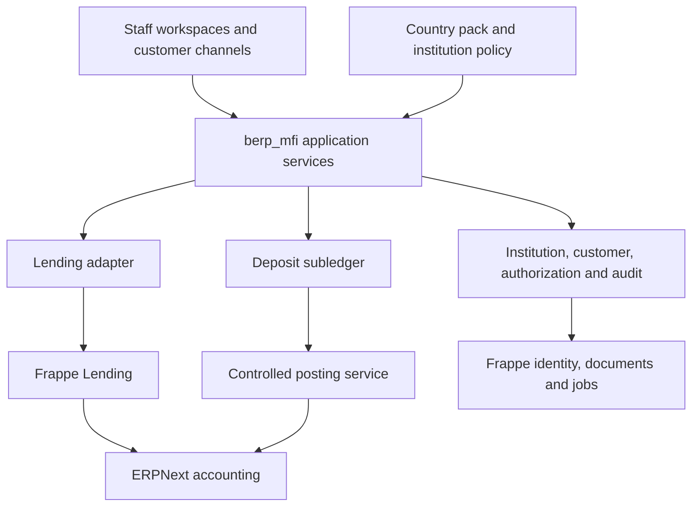

# BERP-MFI-ARCH-001 — Reusable microfinance application

Status: proposed implementation architecture, not deployed software.
Date: 2026-09-15. Requested scope: deposit-taking and non-deposit-taking MFIs.

## 1. Goal, scope and plan

Design `berp_mfi` as a reusable Frappe app for licensed microfinance institutions.
Support different products, organizations and jurisdictions through explicit
capabilities and versioned policy. “Reusable” does not mean automatically compliant
with every license or country. Each deployment requires a validated country pack,
product scope, accounting policy and supported software-version combination.

Maintain this architecture in `docs/BERP-MFI-ARCH-001.md`. The original design was registered in
`docs/AGENTS.md` and `docs/SESSION-LOG.md`. Review it against the existing tenant
boundary and LaoCapital role catalog. Design only: no new app installation,
database changes, role assignments or domain changes are part of this work.

Main risks: conflating loan security with deposits, duplicate ledger posting,
role-based bypass of approval policy, and country rules leaking into the core.
The design below assigns a single owner to each balance and enforcement boundary.

## 2. Application boundaries



| Component | Owns | Must not own |
|---|---|---|
| Frappe | Identity, document lifecycle, permissions, jobs, files | Institution-specific approval policy by itself |
| ERPNext | Chart of accounts, authoritative GL, accounting periods, treasury masters | Customer deposit balances inferred from ordinary bank-account records |
| Frappe Lending | Loan contract/servicing records, schedules, loan accruals and its GL postings | Assumed full deposit banking or local compliance coverage |
| `berp_mfi` | Institution policy, origination controls, deposit subledger, cash operations, authorization and reporting extensions | A second copy of the Lending balance engine or ERPNext GL |
| Country pack | Jurisdictional fields, reports, validated rule versions and account mappings | Tenant names, staff or production credentials |
| Tenant configuration | Legal institution, branches, products, limits, staff assignments, branding | Changes to shared source code for one customer |

Base dependencies: compatible pinned Frappe and ERPNext releases. The lending
capability additionally requires a tested Frappe Lending release. Its adapter
must not be imported or registered when Lending is absent; enabling lending must
fail with a clear dependency error. Deposit capability is owned by `berp_mfi` and
requires its separate release acceptance. Never assume a matching major version
alone establishes compatibility.

`lao_berp` remains optional Lao localization. MFI-specific Lao rules should live in
a future `berp_mfi_la` country pack; it may depend on `lao_berp` where validated.
Existing general-business VAT/CoA defaults must not automatically be applied to
financial products. HR/payroll and branding remain separate optional apps.

## 3. Tenant and institution model

One independent legal MFI per Frappe site/database; one primary ERPNext Company
linked to `MFI Institution`. Branches and service points belong to that institution.
Separate legal entities in a group use separate sites. Group consolidation uses
authorized aggregate exports, not unrestricted cross-site database queries.

Every business root record carries institution, company, branch and currency
where applicable. Validate all linked customer, account, product and ledger records
against those dimensions. Do not trust identifiers supplied by an API caller.
Files, cache keys, jobs, integration credentials and audit events retain site scope.
More demanding isolation may require separate deployments, not only separate sites.

LaoCapital is a tenant configuration of this model: non-deposit-taking, Head Office,
with its existing LC profiles retained until a reviewed mapping is deployed. The
universal app must not contain `laocap.bizera.la`, `LC` names or staff email fixtures.

## 4. Capabilities and license policy

| Capability | Non-deposit-taking preset | Deposit-taking preset |
|---|---|---|
| Customer/KYC, credit, collections, finance, audit | Eligible for activation | Eligible for activation |
| Savings accounts | Disabled | Eligible only if authorized |
| Term/recurring deposits | Disabled | Individually eligible if authorized |
| Customer deposit withdrawals/transfers | Disabled | Limited to enabled products/channels |
| Loan collateral/security funds | Separate reviewed capability | Separate reviewed capability |
| Group lending, agency/mobile channels | Optional after validation | Optional after validation |
| Foreign currency, overdrafts | Disabled initially | Disabled initially |

Presets are setup aids, not proof of legal authority. `MFI License` records issuer,
reference, evidence, effective/expiry dates and permitted activities. A versioned
`MFI Capability Policy` specifies product, currency, branch/channel scope and
operational state: Disabled, Active, Restricted, Run-off. Activation requires
independent approval plus successful readiness checks. A role or visible menu
cannot activate a capability.

Enforce at server transaction boundaries, including imports, generic REST,
background jobs and direct upstream document submissions. Absent, conflicting or
expired policy blocks new business. A separately approved run-off plan determines
permitted repayments, withdrawals and servicing of existing obligations; do not
silently freeze all customer funds or silently continue unrestricted activity.
Never delete history when disabling a capability. Recheck policy at execution time.

Loan security deposits, compulsory savings, membership shares and voluntary savings
must be classified separately by jurisdiction. A “security” label does not exempt
fund-taking from licensing checks. In particular, Lending's security-withholding
feature is not evidence of a complete deposit system or permission to accept funds.

## 5. Functional modules

| Module | Core responsibilities | Principal records/ownership |
|---|---|---|
| Institution & Policy | License, capabilities, holidays, business date, configuration approval | MFI Institution, License, Capability Policy, Policy Version |
| Organization | Branches, service points, portfolios, staff assignment | Reuse Branch/Company; MFI Portfolio, Staff Assignment |
| Customer & KYC | Individuals/entities, beneficial owners, identity, consent, risk review | ERPNext Customer as party; MFI Customer Profile, KYC Review |
| Groups & Centers | Membership history, meetings, group guarantees | MFI Group, Center, Membership; no automatic joint liability |
| Credit Origination | Intake, field visit, assessment, approval, contract evidence | MFI Credit Case, Assessment, Approval Request; link canonical Lending application where supported |
| Loan Servicing | Booking, disbursement, interest, repayment, closure | Existing Lending records through guarded adapter |
| Collections & Recovery | Assignment, contacts, promises, restructure/write-off requests | MFI Collection Case, Promise to Pay; link Lending execution |
| Deposit Products & Accounts | Savings, term/recurring products, opening, maturity, closure | MFI Deposit Product Version, Deposit Account, Account Party |
| Deposit Transactions | Cash in/out, internal transfer, holds, interest, fees, reversals | MFI Deposit Transaction, Deposit Ledger Entry, Account Hold |
| Teller & Cash | Till session, vault transfer, cash limits, counts and differences | MFI Till Session, Cash Transfer, Cash Count |
| Finance & Treasury | Controlled postings, reconciliation, period close, funding | ERPNext GL plus MFI Posting Batch, Reconciliation, Close Run |
| Risk & Compliance | Exceptions, screening adapters, restricted cases, portfolio metrics | MFI Compliance Case, Screening Result, Risk Review |
| Governance & Audit | Delegated authority, approvals, access review, evidence | MFI Authority Rule, Approval Decision, Audit Event |
| Reporting & Channels | Statements, dashboards, country reports, portal/API | Versioned reports, Submission Snapshot, Integration Event |

These are logical modules. Detailed DocType JSON, indexes and field-level permissions
follow in implementation specifications. Do not build a duplicate Customer, Company,
Branch or loan ledger where an appropriate canonical upstream record exists.

## 6. Data and lifecycle contracts

Critical relationships and uniqueness:

- Institution links exactly one primary Company; product versions belong to it.
- Customer Profile links a Customer; Deposit Account has one product version and
  currency, plus one or more Account Parties with explicit signing mandates.
- Credit Case links customer/group, portfolio, product and downstream loan ID.
  Synchronization to an upstream application uses stable unique references.
- Approval Request identifies document revision/hash, action, policy version,
  maker and required approvers. Any material edit invalidates earlier approval.
- Deposit Transaction links immutable ledger entries and one posting batch;
  a reversal links its original transaction. Unique business event keys prevent
  both duplicate posting and duplicate integration delivery.
- Product changes create new effective-dated versions. Existing contracts retain
  agreed terms unless an explicitly approved amendment changes them.

Credit: Draft → KYC Ready → Assessed → Recommended → Approved/Declined/Returned →
Contracted → Disbursement Authorized → upstream servicing → Closed.
No origination-stage label substitutes for upstream loan/document validation.

Deposit opening: Draft → KYC/Mandate Review → Approved → Active → Closing → Closed.
Account status, legal/compliance holds and dormancy are separate dimensions; an
account can be active but debit-blocked. Joint signing, minor/guardian accounts,
death, dormancy/reactivation and term early termination require explicit policies.

Transaction: Draft → Authorized → Posted; rejected/expired authorization cannot
post. Posted records are immutable; corrections create linked compensating entries.
Closure requires zero residual balance, interest/fees settled and no pending
reservations or unresolved cases. Reopening is a separately authorized action.

## 7. Financial integrity and deposit engine

Use decimal monetary arithmetic with currency-specific precision, deterministic
rounding, value date, posting date and branch business date. UTC audit timestamps
remain distinct. Snapshot rate, day-count convention, calendar, accrual method,
rounding, tax and fee rules on the applicable product/contract version.

Deposit subledger is the source for individual account transactions and balances;
ERPNext GL is the source for financial statements. Do not maintain a separately
editable balance field. A cached balance is a rebuildable projection.

Available funds = posted customer balance minus active debit holds/reservations
minus required minimum balance; uncollected funds are unavailable. Overdraft is
unsupported initially. Credit freezes, debit freezes and full freezes have distinct
effects; only authorized services may create/release holds.

For each local financial action, one database transaction must lock the account(s),
recheck available funds and approval, write the subledger and supported GL voucher,
and commit an outbox event. Use stable lock ordering for two-account transfers.
Enforce unique `(integration, event_id)` or equivalent keys at database level.
The same key with a different payload is an error, not a new transaction.

Illustrative entries (final accounts/taxes require country and institution review):

| Event | Debit | Credit |
|---|---|---|
| Cash deposit | Cash/till | Customer deposit liability |
| Cash withdrawal | Customer deposit liability | Cash/till |
| Deposit interest accrual | Interest expense | Interest payable |
| Interest credited | Interest payable | Deposit liability, plus applicable tax payable |
| Transfer between deposit customers | Source deposit liability | Destination deposit liability |

Every GL entry links a source voucher and posting batch. Lending alone owns loan
postings: the MFI adapter must never also post the same loan event. A deposit-funded
loan repayment is one orchestrated event: debit the deposit account and execute
the canonical Lending repayment with atomic accounting, or a reconciled clearing
workflow where atomic execution is unavailable. Block release until this contract
is proven against the selected upstream release.

Bank/mobile rails cannot share a database transaction. Use reservation → dispatch →
confirmed settlement, with idempotent callbacks and explicit Failed/Unknown states.
Timeout is not success or definitive failure; query/reconcile before retry/release.
Reversal after external settlement is a new controlled compensating operation.

Interest/fee batches are restartable and unique by account, business date, rule
version and event type. Backdated corrections must recompute affected accruals by
approved adjustment; never silently rewrite posted history. Period locks apply.
End-of-day requires completed jobs, trial balance, deposit subledger-to-control-GL
reconciliation, loan reconciliation, cash counts and explained exceptions. Maturity,
renewal, dormancy and holidays need deterministic, rerunnable tests.

## 8. Authorization and reusable roles

Resolve access as: site → institution → active staff assignment → capability →
document permissions → branch/portfolio/product scope → state → authority rule →
segregation of duties → amount and exposure limits. Deny unless every requirement
passes. The same resolver governs reads, writes, submission, reversal, reports,
exports, attachments and API services; list-query filtering alone is insufficient.

Use neutral atomic `MFI ...` roles and institution-specific Role Profiles. Retain
the 18 core job functions from BERP-MFI-RBAC-001 as templates, not fixed staff counts.
Optional HR/IT roles do not acquire transaction authority. Deposit extension profiles:

| Profile | Atomic capability intent | Explicit separation |
|---|---|---|
| Deposit Officer | Account opening/maintenance maker | Cannot approve own opening or mandate change |
| Deposit Supervisor | Account/product-operation checker | Cannot silently override holds or license |
| Teller | Authorized cash-in/out execution | No own reversal/limit approval |
| Teller Supervisor | Cash/reversal review within limit | No reconciliation of own cash activity |
| Deposit Operations Manager | Product/maturity operational review | Pricing activation requires independent approval |

Atomic examples: `MFI Credit Maker`, `MFI Credit Assessor`, `MFI Credit Approver`,
`MFI Deposit Account Maker`, `MFI Deposit Checker`, `MFI Cash Operator`,
`MFI Reconciliation Reviewer`, `MFI Compliance Reviewer`, `MFI Audit Reader`.
Approval level and limits live in Authority Rules, not solely role names.

Authority Rules specify action, product, branch, currency, individual amount,
aggregate exposure, risk/exception category, effective dates, quorum and delegation.
Distinct authenticated people must satisfy quorum; two roles on one user do not.
Currency conversion, aggregation windows and anti-splitting rules must be explicit.
Delegations expire and cannot exceed the delegator's approved authority.

Enforce both incompatible assignments and transaction-specific maker/checker rules.
Reject self-approval even if the user gains an additional profile. A small institution
must supply independent oversight, not disable the control. Tenant administrators
can assign only approved profiles within delegated scope; no arbitrary Role,
Custom DocPerm, workflow or script changes through that administration interface.

No application can make database/root administrators powerless. Restrict technical
administration, use break-glass procedures and independently retained audit evidence.
Application audit tables alone are not tamper-proof against infrastructure owners.

## 9. Compliance, reporting and customer channels

Maintain purpose-limited access to identity files, beneficial owners and compliance
cases. Private attachments inherit case authorization; avoid sensitive content in
notifications, logs and general reports. Country policy defines retention, permitted
erasure/anonymization, review intervals and lawful reporting. No generic universal
AML threshold, deposit-insurance claim or regulatory filing schedule is supplied.

Screening/credit bureau integrations capture provider, request/response reference,
timestamp and human decision; provider outages cannot silently pass required checks.
Sensitive reports require separate authorization, immutable submission snapshots
and human submission approval. Do not treat an automated score as final credit policy.

Report definitions version their date basis, currency, population and exclusions.
PAR/NPL definitions, provisioning and deposit coverage rules belong to reviewed
country/institution policy. Show missing data and undefined denominators explicitly.
Customer portals may access only linked accounts; create no public listing endpoints.
External channels, offline collection and agent banking are later capabilities with
limits, signed event provenance, replay handling and settlement reconciliation.

## 10. Package and delivery design

Proposed package, to scaffold only in the implementation phase:

```text
berp_mfi/
  pyproject.toml
  berp_mfi/
    hooks.py
    institution/       # license, policy, organization
    customers/         # KYC, parties, groups
    credit/            # origination and approval controls
    deposits/          # accounts, subledger, interest
    cash_operations/   # teller and cash controls
    governance/        # authority, access, audit
    reporting/
    services/          # authorization, posting, idempotency, business date
    adapters/          # lending, ERPNext, payment/screening providers
    country_packs/     # registry and interface, not embedded legal assumptions
    patches/
    tests/
```

Install creates schema and neutral templates only. All business capabilities begin
disabled; no live users, default passwords, production products or company records.
Setup validates legal entity, license, accounts, currencies, policy, branch, roles
and test evidence before activation. Country rules and capability changes follow
versioned approval with migration previews and rollback/forward-recovery plans.
Pin dependencies in a reproducible release image; no production `develop` tracking.

| Phase | Deliverable | Exit evidence |
|---|---|---|
| 0 | Compatibility and accounting spike | Tested Frappe/ERPNext/Lending pins; deposit voucher proof; approved scope |
| 1 | Core schema, policies, access engine | Two isolated synthetic institutions; no cross-site/branch data access |
| 2 | Non-deposit lending pilot | Origination-to-close plus arrears/reversal tests; balances reconciled |
| 3 | Deposit engine | Parallel withdrawals, interest/maturity/holds, reversals and GL reconciliation pass |
| 4 | Country packs and operational acceptance | Validated rules/reports, restored backup, business sign-off |
| 5 | Channels and scale | Settlement failure tests, load targets met, recovery exercised |

Build deposit contracts into phases 0–1 even though LaoCapital pilots phase 2.
Do not market a functioning deposit product until phases 3–4 pass for that deployment.

## 11. Required acceptance tests

- Two deposit-disabled institutions and one deposit-enabled institution: deny deposit
  creation/posting through UI, REST, imports and jobs when not authorized.
- Expired/restricted license blocks new contracts; permitted run-off still follows
  its separate policy. Policy changes between approval and posting are rechecked.
- Cross-site, branch, portfolio, report and private-file access is denied; sensitive
  compliance fields never leak through search, exports or notifications.
- Maker cannot approve own transaction through extra roles, delegation or API;
  expired delegation, insufficient quorum and split-exposure attempts fail.
- Two concurrent withdrawals cannot overspend; retries and callbacks never double-post;
  transfer is all-or-nothing; crash recovery produces reconciled GL/subledger state.
- Known expected interest outcomes for leap years, rate versions, rounding, holidays,
  backdating, early termination and reruns; accrued/credited/tax balances reconcile.
- Deposit-funded loan repayment posts once; reversal restores correct loan, deposit,
  tax and clearing balances without rewriting original evidence.
- EOD cannot close with unexplained control balances or unknown external settlements.
- Backup restore and release upgrade preserve balances, permissions and audit links;
  performance is measured against institution-approved account/transaction volumes.

RPO, RTO, volume targets, supported countries and first deposit products remain
implementation inputs. No live readiness or compliance is asserted by this design.

## 12. Sources and design basis

Reviewed 2026-09-15:

- [Frappe Lending](https://github.com/frappe/lending): basis for reusing the loan
  engine; not a claim that every required MFI workflow is already implemented.
- [Loan Disbursement](https://docs.frappe.io/lending/loan-disbursement): documents
  loan security withholding; this design deliberately models its classification separately.
- [Frappe permissions](https://docs.frappe.io/erpnext/permissions): permission
  framework foundation; authority and segregation checks above are proposed extensions.
- Internal bERP architecture decisions informed tenant isolation and migration constraints; operational records are not included in this repository.

The Bank of Lao PDR legislation page could not be retrieved in this design session.
No jurisdiction-specific legal conclusion is inferred; country-pack rules require
current primary-source review and institution approval before implementation.
