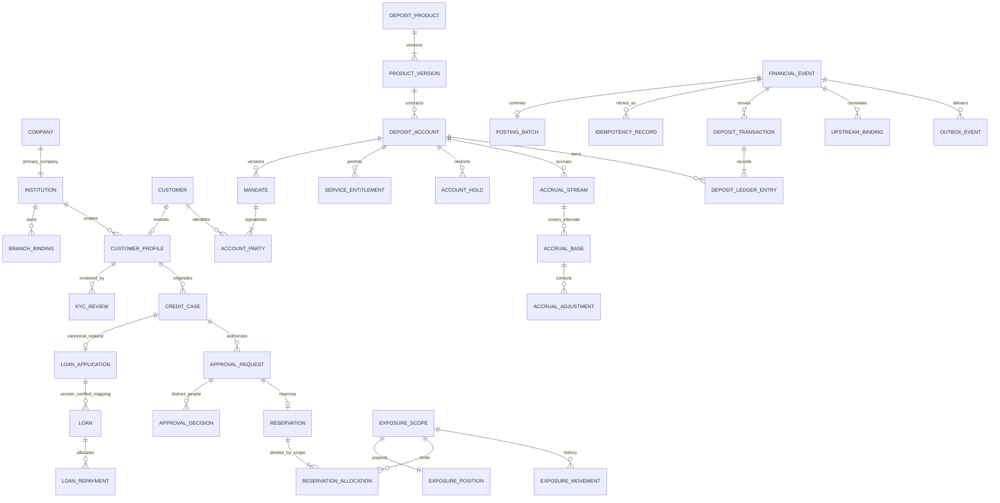

# BERP-MFI-ARCH-001B — Canonical Data Model & Enforcement Registry

Status: DRAFT / DESIGN ONLY — acceptance BLOCKED by B-BLK-01 through B-BLK-03.
Date: 2026-09-15. Parent: [001](BERP-MFI-ARCH-001.md).
Upstream contract: [001A](BERP-MFI-ARCH-001A.md), commit
`3026077e3a9988c4e5baba1720091bb1b9203cd2`; no revision to that contract is made here.

## Definition of Done and document map

> Every invariant in BERP-MFI-ARCH-001A has a concrete record, relationship,
> ownership rule, unique key, state transition, enforcement point, and negative-test mapping.

An invariant that cannot be faithfully represented is BLOCKED and returned to
001A for controlled resolution. It is never relaxed to fit a convenient schema.
Coverage counts are necessary, not sufficient: a TBD enforcement boundary cannot
be counted as accepted. No application scaffolding, DocType JSON, migration, data,
threshold, capability activation, compatibility experiment or routing change is included.

The unit has three inseparable parts:

- This document: registries 1–11, canonical ownership, models and ERD.
- [Enforcement and upstream registry](BERP-MFI-ARCH-001B-enforcement.md): registries
  12–14, immutable source evidence, action/path guards and positive/negative tests.
- [001A traceability](BERP-MFI-ARCH-001B-traceability.md): registry 15, invariant
  inventory and all eight DoD dimensions. Existing `A-G*-*` IDs remain test IDs;
  `INV-A-*` are new invariant IDs, never replacements for those tests.

## 1. Canonical entity registry

Classification: U = existing upstream record; D = proposed standalone MFI DocType;
C = proposed child table owned by its parent; P = rebuildable projection stored
alongside a stable lock row. D/C/P are design decisions, not created schemas.
All D records have UUID identity, immutable creation attribution and revision.
Business roots carry validated institution/company. Child rows inherit scope and
cannot be independently authorized. Financial facts are append-only after posting.

State families S1–S12, keys K01–K25, roles and boundaries are defined below/in companion.
Every proposed record without a special business key still has unique UUID identity;
an index never grants access. No user's email address is a record's immutable key.

| ID | Entity | Kind / owner | Relationships, core content | Key / state |
|---|---|---|---|---|
| E01 | MFI Institution | D / MFI | Exactly one primary ERPNext Company; base currency; policy guard revision | K01 / S1 |
| E02 | MFI License | D / MFI | N:1 institution; issuer/reference/effective interval/evidence | K02 / S1 |
| E03 | MFI Capability Policy | D / MFI | N:1 institution; active approved E04 pointer per capability | K03 / S1 |
| E04 | MFI Policy Version | D / MFI | N:1 policy; immutable terms/hash/effectivity; supports authority/product policy | K04 / S1 |
| E05 | Branch + MFI Branch Binding | U + D / ERPNext + MFI | Reuse Branch; binding associates branch to one institution/company | K05 / S1 |
| E06 | MFI Service Point | D / MFI | N:1 branch binding; permitted channels | K05 / S1 |
| E07 | MFI Staff Assignment | D / MFI | User, institution, role profile, branch/portfolio scope, effective interval | K06 / S1 |
| E08 | MFI Portfolio | D / MFI | N:1 institution; owner and servicing assignments | UUID / S1 |
| E09 | Customer | U / ERPNext | Canonical institution financial party; no duplicate MFI party master | Upstream name / U |
| E10 | MFI Customer Profile | D / MFI | 1:1 institution/Customer; customer-specific attributes, not account balances | K07 / S2 |
| E11 | MFI Account Party | C / MFI | N:1 mandate version; Customer, party role, signing rule | K08 / S1 inherited |
| E12 | MFI Mandate | D / MFI | Versioned account mandate; one account; account parties and authorized targets | K04,K08 / S1 |
| E13 | MFI KYC Review | D / MFI | N:1 profile; approved scope, expiry, evidence, independent reviewer | UUID / S2 |
| E14 | MFI Compliance Case | D / MFI | Profile/account links; restricted case assignment and hold decisions | UUID / S2 |
| E15 | MFI Screening Result | D / MFI | N:1 KYC/case; provider reference, timestamp, restricted result evidence | K09 / S2 |
| E16 | MFI Credit Case | D / MFI | Customer/group, product, portfolio, canonical application link, material revision | K10 / S3 |
| E17 | MFI Field Assessment | D / MFI | N:1 credit case; visit/evidence and verifier; immutable verified revision | UUID / S3 |
| E18 | MFI Credit Assessment | D / MFI | N:1 case; evidence inputs and recommendation; no servicing balance | UUID / S3 |
| E19 | MFI Approval Request | D / MFI | Target type/ID/revision/action; policy hash, maker, required quorum | K11 / S4 |
| E20 | MFI Approval Decision | D / MFI | N:1 request; human principal, decision, delegation and time | K11 / S4 |
| E21 | MFI Exposure Scope | D / MFI | Explicit scope type/owner/dimensions/currency/window; stable identity | K12 / S1 |
| E22 | MFI Exposure Position | P / MFI | 1:1 scope lock row; booked/reserved projections, revision; rebuilt from E26 | K12 / S5 |
| E23 | MFI Exposure Reservation | D / MFI | Approval/source revision, original amount, expiry, currency, event history | K13 / S5 |
| E24 | MFI Reservation Allocation | D / MFI | N:1 reservation and N:1 scope; locked independently; original/remaining shares | K13 / S5 |
| E25 | MFI Authority Consumption | D / MFI | Reservation/scope, approval, source disbursement event, amount | K14 / S6 |
| E26 | MFI Exposure Movement | D / MFI | Scope, event, obligation, booked/reserved/consumed/released deltas | K14 / S6 |
| E27 | Loan Application | U / Lending | Formal application; linked once from credit case; exact version schema pending | K10 / U |
| E28 | Loan | U / Lending | Sole loan contract/servicing owner; linked case and parties | Upstream name / U |
| E29 | Loan Disbursement | U / Lending | N:1 loan; approved capacity consumption linked via E68 | K09 / U |
| E30 | Loan Repayment | U / Lending | N:1 loan; canonical allocation and GL owner; linked via E68 | K09 / U |
| E31 | Loan Restructure | U / Lending | Original contract and approved amendment; no duplicate schedule engine | K09 / U |
| E32 | Loan Write Off | U / Lending | Approved write-off; upstream spelling is not a new MFI DocType | K09 / U |
| E33 | MFI Deposit Product | D / MFI | Institution product identity and approved version pointer | K03 / S1 |
| E34 | MFI Deposit Product Version | D / MFI | N:1 product; currency/rates/calendar/rounding/account mappings | K04 / S1 |
| E35 | MFI Deposit Account | D / MFI | Product version, immutable currency, booking branch, mandate, revision | K15 / S7 |
| E36 | MFI Deposit Transaction | D / MFI | Event/account/signed amount/kind; batch reference; no raw editable balance | K16 / S6 |
| E37 | MFI Deposit Ledger Entry | D / MFI | Transaction/account/sequence/amount/value and posting dates; append-only | K16 / S6 |
| E38 | MFI Account Hold | D / MFI | Account, source action, amount or debit/credit/full freeze, expiry/state | K17 / S8 |
| E39 | MFI Accrual Stream | D / MFI | Account/component/time basis; stable lock row and chain revision | K18 / S9 |
| E40 | MFI Accrual Base | D / MFI | Stream/half-open interval/evidence/posted amount/batch | K19 / S9 |
| E41 | MFI Accrual Adjustment | D / MFI | Original base, expected chain revision, target/delta, correction event | K20 / S9 |
| E42 | MFI Calculation Evidence | D / MFI | Immutable snapshot/hash, segments, unrounded amount and calculation versions | K09 / S9 |
| E43 | MFI Till | D / MFI | Branch/service point/currency/cash GL; limits under approved policy | K03 / S1 |
| E44 | MFI Till Session | D / MFI | Till/cashier/business date; one active session per till | K21 / S10 |
| E45 | MFI Cash Transfer | D / MFI | Source/destination till/bank and approved financial event | K09 / S6 |
| E46 | MFI Cash Count | D / MFI | Session/denominations/count revision/independent reconciliation | UUID / S10 |
| E47 | MFI Reversal Request | D / MFI | Original event, separate approval and reversal event; full reversal v1 | K22 / S4 |
| E48 | MFI Collection Case | D / MFI | Loan, assigned collector/portfolio; no balance ownership | UUID / S2 |
| E49 | MFI Collection Activity | D / MFI | Case/contact/visit/evidence; restricted edits after verification | UUID / S2 |
| E50 | MFI Promise to Pay | D / MFI | Case/amount/date/customer commitment; no financial posting | UUID / S2 |
| E51 | MFI Recovery Action | D / MFI | Case/approval/execution evidence; actual loan event remains upstream | K09 / S2 |
| E52 | MFI Financial Event | D / MFI | Stable business envelope, source identity, result/batch/reversal links | K09 / S6 |
| E53 | MFI Posting Batch | D / MFI | 1:1 posted event; expected legs and matched upstream voucher references | K09 / S6 |
| E54 | MFI Idempotency Record | D / MFI | Principal namespace/operation/key/hash/event link; durable result reference | K23 / S6 |
| E55 | MFI Reconciliation | D / MFI | Company/currency/date/control/evidence; explained vs unresolved breaks | K24 / S10 |
| E56 | MFI Outbox Event | D / MFI | Committed event, audience, message key, delivery attempt state | K09 / S11 |
| E57 | MFI Audit Event | D / MFI | Redacted actor/action/outcome; financial or separate denied-action evidence | K09 / S12 |
| E58 | MFI Service Entitlement | D / MFI | Principal/assignment/account or relationship/actions/expiry, approval | K06 / S1 |
| E59 | GL Entry | U / ERPNext | Sole authoritative GL; no independent MFI GL table | Upstream name / U |
| E60 | Journal Entry | U / ERPNext | Candidate deposit-leg voucher; source-guarded; compatibility pending | K09 / U |
| E61 | Payment Entry | U / ERPNext | External cash/bank flows only when contracted; never extra G5 leg | K09 / U |
| E62 | MFI Business Close | D / MFI | Institution/branch/date, locked close state, reconciliation references | K24 / S10 |
| E63 | MFI Group | D / MFI | Institution group identity used by credit and exposure | K03 / S1 |
| E64 | MFI Group Membership | D / MFI | Group/Customer/effective interval, immutable approved changes | K06 / S1 |
| E65 | MFI Authority Rule | D / MFI | Approved version links stable E21 scopes; quorum/exposure inclusion rules | K04 / S1 |
| E66 | MFI Delegation | D / MFI | Delegator/delegate/principal authority/effective interval and cap | UUID / S1 |
| E67 | MFI Control Account Binding | D / MFI | Company/currency/control purpose/ERPNext Account/approved version | K25 / S1 |
| E68 | MFI Upstream Binding | D / MFI | Event or case ↔ one verified upstream document; purpose distinguishes links | K09,K10 / S6 |
| E69 | MFI Evidence Bundle | D / MFI | Release SHAs/test ID/inputs/expected/actual/reviewer decision | UUID / S12 |

Frappe User, Role, Role Profile, File and ERPNext Company/Account/Currency are reused
upstream masters; no parallel identities are proposed. MFI Branch Binding prevents
inventing an `MFI Branch` duplicate. E24 is standalone, not a freely editable child
table, because concurrent reservations require independent locking and immutable events.
E68 records correlation, not financial values or a second financial owner.

## 2. Ownership registry

| Economic fact | Authoritative owner | Projection / prohibited alternative |
|---|---|---|
| Loan servicing, schedules, repayment allocation | E28–E32 / Lending | E16/E18 and dashboards never post/recalculate loan balances |
| Deposit customer balance | Sum of posted E37 / MFI | E35 cached amount is derived; no direct balance mutation |
| Deposit accrual recognized net | E40 plus E41 / MFI | E42 is evidence; changing it cannot change recognized value |
| GL financial statements | E59 / ERPNext | E53 is correlation/control evidence, not a second GL |
| Booked loan exposure source | Lending canonical obligations | E26 records inclusion/deltas for each applicable scope |
| Reserved capacity and consumption | E23–E26 / MFI | E22 is a rebuildable projection with revision reconciliation |
| Approvals/mandates/entitlements | E12,E19,E20,E58,E65,E66 / MFI | Role membership alone never authorizes a financial action |
| Customer financial identity | E09 / ERPNext | E10 extends one Customer; no new institution-party balance master |

Each internal settlement batch has two GL-producing vouchers but one owner for each
leg: MFI deposit voucher and Lending repayment. Only ERPNext stores final GL entries.
For loan accruals the upstream owner remains Lending, even when MFI stores mappings.

## 3. Canonical ERD

The application→loan multiplicity is a storage upper bound, not authorization for
multiple bookings. Product policy and the pinned upstream mapping constrain allowed
conversion counts. `E68` prevents duplicate conversions for a stable source event.
One posted repayment event must link exactly one E30 and one E53; a received/rejected
event may link neither. Branch booking/service relationships are specified in §9.

## 4. Identity, unique keys and indexes

All keys are within the site database. `I` means institution; normalize explicit
scope serialization including absent dimensions—SQL NULL behavior cannot create
duplicate “global” scopes. Currency/time bases are immutable on an economic identity.

| Key | Required uniqueness / predicate | Lock or additional check |
|---|---|---|
| K01 | One E01 per site; primary Company unique | Setup authority; deny second legal institution |
| K02 | I, issuer, license reference | Effectivity and evidence validation |
| K03 | I, typed business code | Active version pointer, serialized policy updates |
| K04 | Parent object, immutable version number | Approved interval conflict check; policy lock |
| K05 | Branch unique in binding; service-point code unique per I | Company/institution validation |
| K06 | UUID plus subject/scope/action/effective-interval lookup index | Reject duplicate active grants or overlapping conflicting membership under policy lock |
| K07 | I, Customer | Same institution relationship; no branch partition |
| K08 | Mandate, Customer, party role | One active mandate version per account under account lock |
| K09 | I, source namespace, source ID, operation/purpose | Stable economic source independent of transport key; exact event→batch uniqueness |
| K10 | Case + canonical application binding unique; upstream target + purpose unique | Controlled conversion request; no duplicate formal applications |
| K11 | Target, target revision, action, request ID; request, human principal, decision slot | Quorum counts distinct people; material edit invalidation |
| K12 | I, scope type, canonical owner/dimensions, currency basis, window | Unique scope/position lock row; rule version excluded |
| K13 | Approval/source revision/action; reservation, scope | Lock scope and reservation; all-scope success or rollback |
| K14 | Event, scope, obligation, movement kind; consumption event + allocation | Append-only signed movements; consume/release once |
| K15 | I, account number; internal UUID separately unique | Product/currency/mandate binding checks |
| K16 | Event, deposit account, leg; transaction, sequence | Immutable ledger facts; no extra debit from retries |
| K17 | Account, source action identity | Amount/freeze changes under same account lock as debit |
| K18 | I, account, component | Unique stream creation with conflict retry; stable stream lock |
| K19 | Stream, interval start, interval end | Under stream lock reject start < existing_end AND end > existing_start; index stream/start/end |
| K20 | Original base, correction event | Locked expected chain revision; version/segment cannot create a second base |
| K21 | Session UUID; till active-session guard pointer | Till lock; no second active session despite multiple users |
| K22 | Original event, full reversal operation | Original-event lock; partial reversal unsupported |
| K23 | I, principal namespace, operation, idempotency key | Compare canonical hash; link to stable K09 event; retain for event retention life |
| K24 | Company, currency, business date, branch/control purpose, approved run revision | Closing/date guard lock; immutable approved snapshots |
| K25 | Company, currency, control purpose, effective version | Guard account changes and incompatible control roles |

Expose unique collisions as deterministic conflict/original-result outcomes. UUID
uniqueness does not replace K09 business-source uniqueness. Composite predicates,
interval non-overlap, quorum, and conservation are service invariants under locks,
not claims of native Frappe or MariaDB exclusion constraints. 001C must certify
physical field sizes/collations/decimal types; no DB DDL is produced here.

## 5. State-machine registry

Domain state and Frappe docstatus are distinct. Posted evidence is submitted/immutable
where supported; exact mapping to upstream docstatus is verified in compatibility work.

| State | Allowed path | Transition authority / prohibitions |
|---|---|---|
| S1 Policy/master | Draft → Reviewed → Approved → Active → Restricted/Expired/Retired | Independent policy approver; new version for material edits; history retained |
| S2 KYC/case | Draft → Review → Approved/Rejected/Held → Closed; new review for renewal | Assigned reviewer; hold release separate approval; KYC expiry enforced at action |
| S3 Credit/assessment | Draft → Verified/Assessed → Recommended → Decided | Independent assessor; verified revision immutable; E19 controls subsequent financial action |
| S4 Approval/reversal | Requested → Approved/Denied/Expired/Invalidated → Executed | Distinct people/quorum; target revision immutable; single execution event |
| S5 Reservation | Requested → Reserved → PartiallyConsumed → Consumed or Released/Expired | Derived amounts conserve; expiry releases only outstanding; all transitions via E26 |
| S6 Financial event | Received → Posted OR Rejected; Posted → Reversed via separate event | POSTED atomically with all required legs; PROCESSING/lease is not financial state |
| S7 Account | Draft → Reviewed → Active → Closing → Closed | Mandate/KYC/product authority; closed requires zero settled balance/no holds or pending events |
| S8 Hold | Requested → Active → Released/Expired | Same account lock as debit; release authority and stable source; indefinite freezes do not auto-expire |
| S9 Accrual | Calculated → Posted; later correction is a separate Posted or NoChange record | Stream/chain locks; never reopen interval for duplicate base |
| S10 Cash/close | Open → Counted → Reconciled → Closed; Exception blocks close | Independent reconciliation; approved new revision if correction required |
| S11 Outbox | Pending → Delivering → Delivered or Retry | Financial outcome remains Posted; unique consumer message ID |
| S12 Audit/evidence | Recorded → Reviewed/Accepted/Rejected evidence decision | Evidence immutable; review outcome does not mutate a financial event |
| U Upstream | Selected release's canonical lifecycle | E68 maps event and approval; no invented common upstream status field |

Retries do not introduce additional transitions. Mandate/KYC expiry and debit/credit
freezes are independent account restrictions, not overloaded S7 states. Reversal
flags are derived from linked events, not authorization to edit old ledger amounts.

## 6. Financial event registry

| Event | Source / records | Voucher owner and atomic postconditions | Boundary / test |
|---|---|---|---|
| CREDIT_RESERVE | E19,E23,E24,E26 | No GL; approval and all scope allocations commit together | EN02 / B-T05 |
| LOAN_DISBURSE | E29,E25,E26,E52 | Lending GL only; reservation→booked exposure once | EN03 / B-T06 |
| DEPOSIT_CREDIT/DEBIT | E36,E37,E38,E53 | MFI-approved voucher; funds/mandate checks under account lock | EN05 / B-T08 |
| DEPOSIT_TRANSFER | Two E36 legs + one E52 | MFI voucher; both accounts locked, equal currency/amount, no partial posting | EN05 / B-T08 |
| DEPOSIT_ACCRUE | E40,E42,E53 | MFI voucher; no overlapping base interval | EN06 / B-T03 |
| ACCRUAL_ADJUST | E41,E42,E53 | Delta only; zero-delta evidence without financial voucher | EN06 / B-T04 |
| DEPOSIT_TO_LOAN | E36,E37,E30,E53,E68 | G5: MFI Dr liability/Cr C; Lending Dr C/Cr allocation; X=X and C=0 | EN07 / B-T10 |
| FULL_REVERSAL | E47,E52,E68 | Canonical Lending compensation plus MFI counterpart; no deletion | EN08 / B-T11 |
| CASH_TRANSFER | E45,E44,E52 | Approved cash voucher only; never duplicated with Lending tender posting | EN05 / B-T08 |
| RESTRUCTURE/WRITE_OFF | E31/E32 + E19/E68 | Lending executes; MFI approval and exposure mapping only | EN03 / B-T07 |
| IMPORT_OPENING | Approved maintenance E52/E68 | Traceable mapped upstream opening vouchers; ordinary import flags forbidden | EN12 / B-T16 |
| CLOSE | E55,E62,E69 | No balancing plug; unexplained mismatches deny close | EN10 / B-T12 |

Unspecified financial event types are unsupported, not free-form journal authority.
G5 posting remains blocked at source-adapter proof; these entries are contractual,
not evidence that the pinned Lending supports the proposed control account.

## 7. Accrual/adjustment schema contract

E39 fields: institution, account, component, interval basis, calendar reference,
revision. E40: stream, interval_start/end, partition reference, calculation_evidence,
posted_amount, posting_batch, chain_revision. E41: original_accrual, correction_event,
expected_chain_revision, target_amount, prior_net, delta_amount, posting_batch optional
only for NoChange. E42: immutable basis snapshot/hash, calculation/policy/rate
versions, unrounded result, rounding mode, segment ordering and derivation inputs.

Dates use half-open normalized intervals in the immutable stream basis. Reject empty
or reversed intervals. Lock E39, then detect overlap with all original posted bases;
reversed bases remain occupied economic identities with compensating adjustments.
Repartitioning produces evidence and delta correction against existing bases, never
a new original over the same covered time. Segment sequence is not part of K19.

Under stream/chain locks: expected revision must match; recognized net = base + all
posted adjustments; delta = approved target − recognized net. Serialize concurrent
corrections, increment chain revision once, link GL and audit in the same transaction.
Zero delta records NoChange evidence and consumes its request once. No fake batch
with non-existent GL is created. Loan accrual evidence links upstream records only.

## 8. Exposure/reservation schema contract

E21 scope types: BORROWER, BORROWER_GROUP, PRODUCT, BRANCH, INSTITUTION,
APPROVER_BUDGET, DISBURSEMENT_AUTHORITY. Every type has a typed owner; optional
dimensions cannot partition a broader scope accidentally. Lifetime windows and
dated windows serialize explicitly. Rule version belongs in E65/E04, never K12.

E22 is a stable lock/projection row per scope. E26 is the append-only movement
history, with canonical obligation/event references, signed changes, expected
position revision and currency basis. Rebuild must reconcile to Lending booked
obligations plus MFI reservations; projection mismatch blocks new increases.
E23 records original reservation/currency/approval/expiry; E24 stores allocations
per applicable scope; E25 records consumption keyed by financial event/allocation.

Signed authorized adjustments modify effective original amount through E26.
For each reservation/allocation: effective original = outstanding + consumed +
released; validate nonnegative operational buckets. Different scopes may each count
the same obligation once; totals across scopes are not summed into global exposure.

Reserve all applicable scopes atomically under the 001A lock order. Consumption
reduces reserved and increases booked exposure in the same canonical disbursement
transaction. Expiry never releases consumed amounts. Unknown outcomes retain
capacity; definitive reversal releases only restored exposure. Budget reuse depends
on its rule and cannot follow loan repayment automatically. Group/rule updates
remap under policy/scope locks; no-match or conflict denies new commitments.

## 9. Party/account/branch relationships

An institution's party is E09 + E10, independent of branch. Loan binding and E35
each have booking branch, relationship owner, portfolio and authorized servicing
branches. E58 expresses actions for a specific account/relationship and assignment.

| Relationship | Institution / company | Branch condition | Sensitive access |
|---|---|---|---|
| Profile ↔ Customer ↔ loan/account parties | Must match resolved I/company association | Customer has no universal branch-equality rule | Minimal identity lookup only |
| Product/account ↔ control account | Must match I/company/currency | Approved booking branch required | Account detail requires entitlement |
| Loan A ↔ deposit B for payment | Same I/company/currency; explicit mandate target | May cross branch with servicing entitlement | Identity match is not payment authority |
| Staff ↔ serviced account | Active same-I assignment and E58 | Booking branch may differ from service branch | Scope exact actions, time and portfolio |
| Account ↔ signatories | Same-I party association, approved mandate version | Branch never substitutes for signing authority | KYC permission separate from mandate view |
| KYC/AML case ↔ staff | Same I, specific case/purpose assignment | No cross-branch visibility by branch role alone | Explicit case entitlement required even at Head Office |
| Independent institutions | Never cross-link database/business records | No branch rule can override site boundary | Deny all ordinary cross-site access |

No sensitive class is automatically visible across branches. Authorized institution
compliance staff may service cross-branch cases through explicit case entitlements.
Account booking-branch changes are approved amendments; audit history retains the
original context. Files inherit case/account authorization at retrieval, not merely upload.

## 10. Permission and entitlement matrix

R=read within scope; M=make draft; A=independent approve; X=execute approved action.
All grants require active assignment + capability + entitlement + current policy.
Unlisted actions deny. Native Administrator/root is outside ordinary business roles.

| Role family | E16–E20 credit | Deposit/mandate | Financial posting | KYC/AML | Governance |
|---|---|---|---|---|---|
| Credit Maker | R/M own portfolio | Minimal party lookup | None | Submit evidence, no approval | None |
| Credit Assessor | R/M assessment | None | None | Authorized KYC outcome only | None |
| Credit Approver | R/A within limit, never own | None | No cash execution | Required clearance outcome | None |
| Deposit Maker / Checker | Limited required party context | M / A respectively | None | Clearance outcome | None |
| Teller | Approved transaction context | R required fields | X within mandate/till limits | No raw sensitive cases | No own reversal approval |
| Finance Maker / Reviewer | Reconciliation sources only | Control totals | M / A approved voucher/correction respectively | None by default | Close/reconciliation scope |
| Compliance Reviewer | Purpose-limited R | Hold request/release authority | No ordinary cash posting | R/M/A assigned cases with SoD | Compliance policy proposal |
| Audit Reader | R authorized evidence | R authorized evidence | No posting | Separate case grant | R immutable audit |
| Tenant Configuration | No business grant | No business grant | None | None | Approved profile allowlist only |
| Scoped service principal | Bound initiating action | Bound initiating action | Execute one validated event | Only policy outcome needed | No autonomous privilege expansion |

Approvers are distinct human principals, not distinct role rows. E66 delegation
cannot exceed parent authority or outlive it. Material target changes invalidate
E19. No business role edits E37/E40/E41/E59 directly after posting. Export, print,
download, report and list access are separately evaluated, not inherited from UI menus.

## 11. Sensitive-data matrix

| Data | Storage | Allowed minimum | Enforcement |
|---|---|---|---|
| Party lookup | E09/E10 | Customer ID and necessary display fields within assignment | EN01 list/query + document read |
| IDs, DOB, address, household, photos/GPS | E13/E17 + private File | Assigned purpose-specific officer/reviewer | EN01 field redaction + private-file authorization |
| Screening/PEP/AML case details | E14/E15 | Explicit compliance case staff; auditor only by separate grant | EN01 case checks, no global search disclosure |
| Deposit balance/mandate | E35/E12/E37 | Account/service entitlement and required action | EN01/EN05; KYC permission insufficient |
| Loan allocation/credit evidence | E18/E28/E30 | Portfolio or explicitly assigned review | EN01/EN03 |
| Audit and outbox payload | E56/E57/E69 | Redacted event metadata; approved consumer only | EN09; no secrets/full KYC |

Frappe permission levels may support field control but do not prove API/report/file
redaction. Retention/erasure is governed by country policy, preserves required
financial identities and event deduplication, and is not implemented by deleting
ledger facts. Country-specific periods and thresholds remain unset.

## Acceptance disposition

Registries 12–15 are in the companion documents. B-BLK-01 identifies the actual
pre-hook locking concern; B-BLK-02 incomplete route/flag inventory; B-BLK-03
atomic voucher compatibility. Source snapshots are not a release certification.
001B is NOT READY FOR ACCEPTANCE while these exact-boundary/proof dependencies
remain unresolved. No invariant is weakened; G2–G5 and audit F02–F05 remain open.
